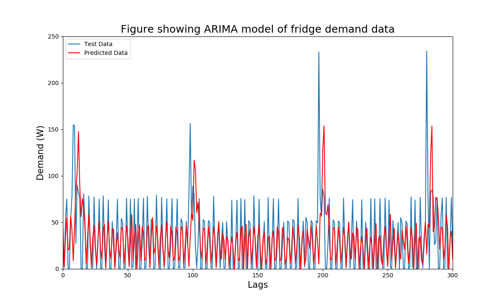

# Electricity Processing

Project to download from AWS S3 and analyse electricity demand and price data that has been from WiFi enable smart plug. Serves as a follow up to https://github.com/Vlasko/electricity-upload which lives on a Raspberry Pi and collects, then uploads the data to S3.

To use this project AWS keys will need to be saved in the necessary folders.

## Downloading
Files not stored on machine can be downloaded by running `downloading.py`, and can then be graphed using `graphing.py`

## Analysis
I have started to experiment with using ML to fill the gaps in the data, so far the best model is ARIMA (4,1,0) on the first 1,000 data points.

# To Do
- [x] Update ReadMe
- [ ] Amend keys storage to allow other users to save their own keys
- [ ] Create `setup.py` to create necessary file structure to store data
